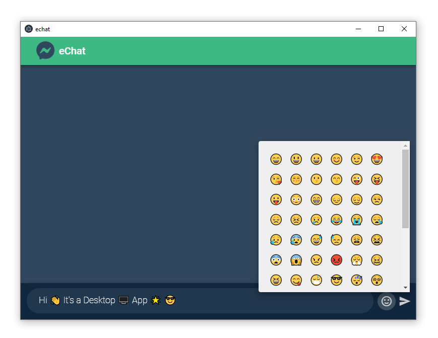

    
    <h2 align="center">eChat</h2>
    
<b>Desktop Chat Application built with Vue + GoLang! 🔥</b>

 

# Screenshot

    

# Features

- ⚡ Fast
- 🏄 Light Weight
- 🤩 Emoji Support

_Inspired by Facebook's Messenger UI & Vue logo Theme_
